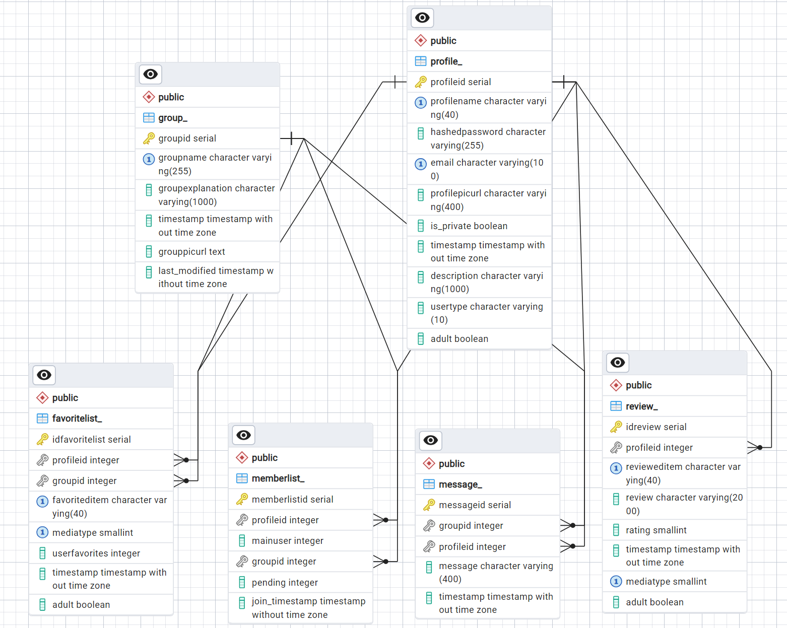
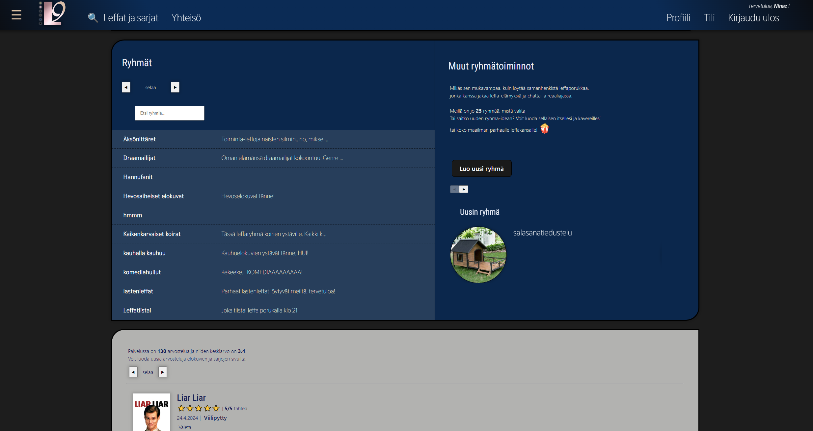

## Elokuvaharrastajien sivusto: Leffaysi
---------------------------------

#### Tekijät

- Hannu Karjalainen ([HannuKarjalainen](https://github.com/HannuKarjalainen))
- Tapio Kylmämaa ([xolooh](https://github.com/xolooh))
- Jimi Jakola ([jimijakola](https://github.com/jimijakola))
- Matti Nieminen ([Majuniemi](https://github.com/Majuniemi))
- Rebecca Soisenniemi ([suklaanen](https://github.com/suklaanen))

---------------------------------

Tämä repositio esittelee Oulun ammattikorkeakoulun 2. vuoden tieto- ja viestintätekniikan opiskelijoiden tekemää elokuvasivustoa, joka kuuluu toteutukseen **Web-ohjelmoinnin sovellusprojekti** (15 op). 

Hankkeen tarkoituksena on oppia kokonaisvaltaista ohjelmistokehitystä ketteriä menetelmiä sekä versionhallintajärjestelmää käyttäen. 

Hankkeesta vastanneet tekijät ovat yllämainitut Matti Nieminen, Jimi Jakola, Hannu Karjalainen, Rebecca Soisenniemi ja Tapio Kylmämaa. Ryhmästä kaikki ovat osallistuneet jokaisen osa-alueen toteuttamiseen.

## Sivuston kuvaus

Elokuvasivusto on kokonaisvaltainen palvelu käyttäjälle, joka haluaa saada kattavaa tietoa elokuvista ja sarjoista yhdestä paikasta. Sovellus yhdistää React-projektina toteutetun käyttöliittymän ja Node.js -palvelimen, joka on yhteydessä tietokantaan.

Yhteisöllisyys on sivustolla merkittävässä roolissa. Sivustolla voi luoda ryhmiä, joissa käyttäjät voivat jakaa ja lukea arvosteluja elokuvista ja sarjoista. Jäsenet voivat kirjoittaa ryhmäsivulle viestejä ja jakaa näytösaikoja muille jäsenille. 

Sovelluksen käyttämät tiedot elokuvista ja sarjoista haetaan The Movie Databasen tietokannasta rajapinta-avaimella. Finnkinon tarjonta saadaan sen antamasta datasta. 

## Teknologiat

  	Tietokanta: PostgreSql
	Käyttöliittymä: React, Vite
	Palvelin: Node.js
	Tietoturva: CORS, JWT, Middleware, Bcrypt
	Testaus: yksikkötestit Mocha Chai, end-2-end Robot Framework
    Konttiteknologia: Docker
    Arkkitehtuuri: Separation into components

#### Ohjelmistoarkkitehtuuri

Sovelluksen ohjelmistoarkkitehtuuri noudattaa jäsenneltyä mallia, jossa sisältö on organisoitu mahdollisimman selkeästi asioiden mukaan. Palvelinpuolen toteutuksessa kunkin toiminnallisen kokonaisuuden vastuut on jaettu omiin ryhmiin. Ryhmien osat on jaettu pääasiassa ```Routes-, Service- ja Model-``` tiedostoihin. Näistä Routes vastaa reitityksestä ja ohjaa pyynnöt Service-luokkiin. Service puolestaan vastaa bisneslogiikasta ja keskustelee Modelin kanssa. Model-kerros hoitaa tietojen hallinnan ja käsittelyn. 

Käyttöliittymäkomponenttien osalta pyrimme myös jakamaan sisällön loogisiin kokonaisuuksiin, jotta niitä on helppo käyttää ja ylläpitää. 


#### Tietokanta
Sovelluksessa on käytössä PostgreSQL-tietokanta, johon tallennetaan käyttäjän tiedot, oikeudet, arvostelut, suosikit ja ryhmät. Tietokanta on viety Render-pilvipalveluntarjoajalle. 

Alla olevassa kuvassa on esitetty tietokannan ER-kaavio, joka kuvaa tietokannan rakennetta. 


<sup>KUVA 1. Tietokannan ER-kaavio</sup>

Tietokannassa on vältetty monen suhde moneen -yhteyksiä luomalla aputauluja. Näihin tauluihin tulee automaattisesti luotu pääavain ja vierasavaimet tauluista, joiden välille tarvitaan useita yhteyksiä. Esimerkiksi samassa ryhmässä voi olla lukuisia jäseniä, mutta sama henkilö voi olla myös useammassa ryhmässä.

#### Käyttöliittymä
Palvelun käyttöliittymä on toteutettu käyttäen nykyaikaisia web-tekniikoita, kuten React-kirjastoa sekä Vite-kehitystyökalua. Reactin avulla saadaan luotua tehokas ja dynaaminen käyttöliittymä. Vite puolestaan tarjoaa kehittäjille nopean kehitysympäristön ja paketinhallintajärjestelmän. Nämä helpottavat käyttöliittymäkoodin kirjoittamista, testaamista ja optimointia. 

Sivusto ja sen osat on tehty mukautuviksi, joten esimerkiksi sivuston asettelut ja tyylit mukautuvat näytön koon muuttuessa. Samalla se on toteutettu saavutettavaksi ja käyttäjäystävälliseksi. Käyttäjän on esimerkiksi mahdollista valita sivustolle teema (kuva 2), joka asettaa sivuston värimaailman tummaksi tai vaaleaksi riittävillä kontrastieroilla. Kuvat ja sivulinkit on toteutettu siten, että ne voi muuttaa puheeksi helppokäyttötoiminnoilla. 


<sup>KUVA 2. Käyttöliittymä tummalla teemalla</sup>

Käyttöliittymän arkkitehtuuri noudattaa modulaarista lähestymistapaa, jossa eri osat on ryhmitelty kokonaisuuksien mukaisesti. Runkotiedosto toimii keskeisenä osana reititystä, jonka avulla käyttäjä voi selata sivustoa. Eri näkymiin on sisällytetty uudelleenkäytettäviä komponentteja.

#### Palvelin
Sovelluksen palvelin mahdollistaa tietokannan käytön sivustolla sekä ohjaa tietokantakyselyt ja sieltä palautuvat vastaukset oikeille paikoilleen. Se myös vastaa tietoturvasta ja säilyttää arkaluontoiset tiedot, kuten rajapinta-avaimet ja salasanat käyttäjän ulottumattomissa. 

Palvelin tarjoaa REST-rajapinnan käyttöliittymälle, jolla se voi hakea dataa tietokannasta. Rajapinta itsessään sisältää lukuisia päätepisteitä eri toiminnallisuuksiin. Esimerkiksi yllä olevassa kuvassa on esitelty päätepiste arvostelujen lisäämiseksi tietokantaan.

Tietoturvan takaamiseksi on käytetty Cross-origin Resource Sharing (CORS)-, JSON Web Token (JWT)-, Middleware- sekä Bcrypt-menetelmiä. Näillä teknologioilla voidaan varmentaa käyttäjän istuntojen oikeellisuutta (JWT) ja salata tietokantaan tallennettavat salasanat (Bcrypt). Middlewaren avulla suojataan haluttuja päätepisteitä, millä voidaan estää luvattomat tietokannan toiminnot. CORS puolestaan mahdollistaa tiettyjen verkkosivujen sallimisen ja estämisen tarpeen mukaan. 

## Sovelluksen käyttöönottaminen
Sivustolle pääsee Render-pilvipalvelun ylläpitämänä verkko-osoitteessa https..... 
Sovelluksen voi myös halutessaan ladata itselleen paikallisesti käytettäväksi seuraavilla ohjeilla. 

1.	Kloonaa tämä repositio omalle koneellesi
2.	Hanki oma rajapinta-avain The Movie Database -sivustolta
3.	Luo arkiston juureen **.env-tiedosto** ja lisää sinne rajapinta-avain sekä muut tarvittavat ympäristömuuttujat. Lue ohjeet tämän tekemiseen arkiston tiedostosta
```env-example```
4.	Suorita poluissa backend ja frontend komento
```npm install```
5.	Avaa Docker Desktop -työpöytäsovellus ja suorita arkiston juuresta komento
```docker compose up –d```
6.	Käynnistä palvelin polusta backend komennolla
```npm start```
7.	Käynnistä käyttöliittymä polusta frontend komennolla
```npm run dev```
8.	Avaa selain ja siirry osoitteeseen 
```http://localhost:5173/```
9.	Nauti! 😀 